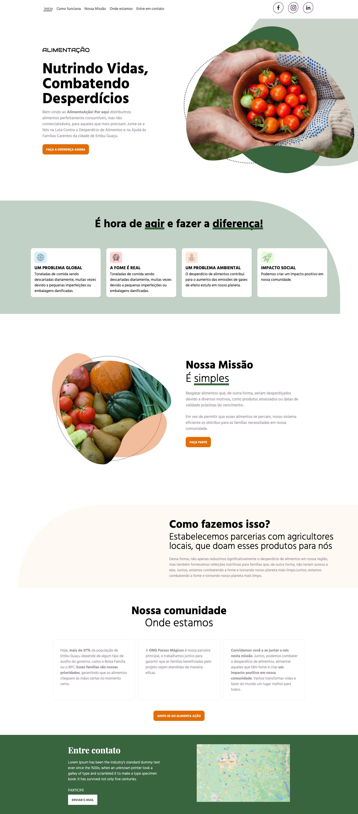

# Hack for Change - AlimentaAção

Bem-vindo ao AlimentaAção! Por aqui distribuímos alimentos perfeitamente consumíveis, mas não comercializáveis, para aqueles que mais precisam. Junte-se a Nós na Luta Contra o Desperdício de Alimentos e na Ajuda às Famílias Carentes da cidade de Embu-Guaçu.

  

## Missão

Resgatar alimentos que, de outra forma, seriam desperdiçados devido a diversos motivos, como produtos amassados ou datas de validade próximas do vencimento.

Em vez de permitir que esses alimentos se percam, nosso sistema eficiente os distribui para as famílias necessitadas em nossa comunidade.

Além disso, a gente colabora para um meio ambiente mais sustentável, já que o desperdício alimentar é um dos responsáveis pelo aumento da emissão dos gases do efeito estufa (7%).

## Como fazemos isso?

Estabelecemos parcerias com agricultores locais, que doam esses produtos para nós

Dessa forma, não apenas reduzimos significativamente o desperdício de alimentos em nossa região, mas também fornecemos refeições nutritivas para famílias que, de outra forma, não teriam acesso a elas. Juntos, estamos combatendo a fome e tornando nosso planeta mais limpo.Juntos, estamos combatendo a fome e tornando nosso planeta mais limpo.

## Impacto

O impacto do nosso projeto é notável =) 

Reduzimos significativamente o desperdício de alimentos na nossa região, ao mesmo tempo em que fornecemos alimentação nutritivas para famílias que de outra forma não teriam acesso a elas. 

Hoje, mais de 27% da população de Embu Guaçu recebem algum auxílio do Governo, como Auxílio Brasil, Bolsa Família, BPC, que são potenciais beneficiários desses alimentos.

Mate a fome de quem tem fome!

## Futuro

Além dos Agricultores, Supermercados, Restaurantes são potenciais parceiros. Além disso, além de atender as famílias da comunidade, nosso produto tem como objetivo atender escolas e instituições de caridade, casas de asilos, orfanatos, entre outros.

## Faça parte você também!

Por fim, eu convido todos a juntarem a nós nessa missão. Vamos combater o desperdício de alimentos, alimentar aqueles que têm fome e criar um impacto positivo em nossa comunidade.

## 👩 Author

| [ <b>@laisfrigerio</b>](https://github.com/laisfrigerio)  |
| :---: |

## 📄 License

This project is licensed under the MIT License - see the LICENSE.md file for details
